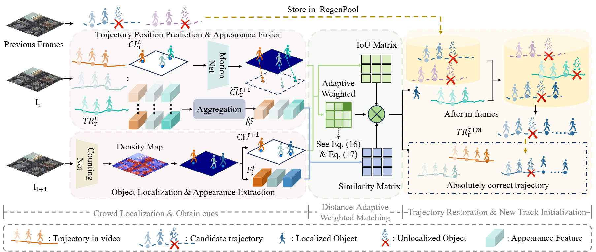
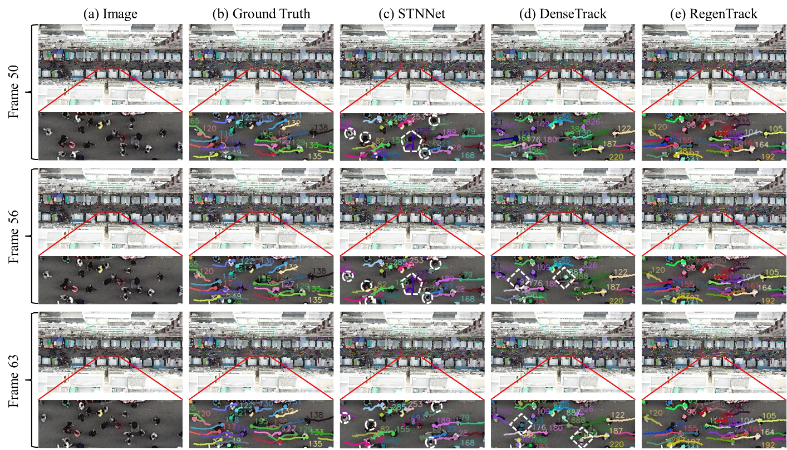
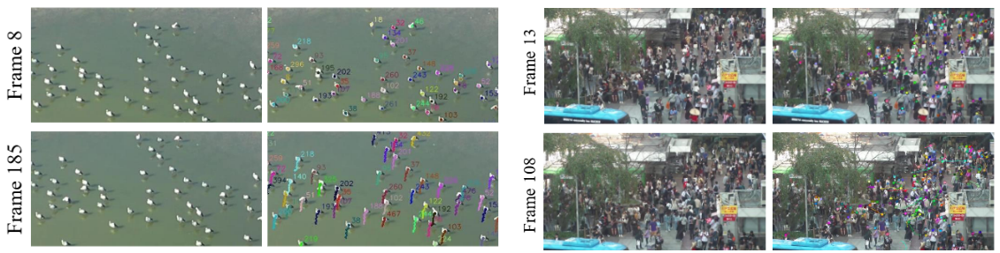

# 🔥 RegenTrack: Distance-Adaptive Regeneration Pool Matching for Drone-Based Crowd Tracking

[[Paper]](https://ieeexplore.ieee.org/document/11424624) | [[Pretrained_weight]](https://pan.baidu.com/s/1nEGTyAl4LC-mlsLFu1h99Q?pwd=6757)

Official implementation of **"RegenTrack: Distance-Adaptive Regeneration Pool Matching for Drone-Based Crowd Tracking"** (Accepted by IEEE TCSVT).
 
We propose **RegenTrack**,  a tracking framework that integrates distance-adaptive fusion with Regeneration Pool matching to address challenges in drone-based crowd tracking，achieving better performance on **DRONECROWD, DRONEBIRD, and CROHD dataset**.

---

## 📢 News

- [2025.9.6] Upload code
- [2026.3.8] Upload pretrained model
- [2026.2.23] Accept by TCSVT!


## 🧠 Overview

<!-- ### 🔹 Method Description -->

<!-- Our method focuses on:

- xxx
- xxx
- xxx

Compared with previous methods, our approach:

- Improves xxx
- Reduces xxx
- Enhances xxx -->

### 🔹 Framework



---

## 🎨 Visualizations

### Compared with UAV crowd tracking methods



### tracking results on DroneBird and HT21



---

<!-- ## 📈 Progress

- [x] Training code
- [x] Testing code
- [x] Pretrained models
- [ ] Demo
- [ ] More experiments

--- -->

## ⚙️ Environment

```bash
python >= 3.8
pytorch >= 2.0.1
faiss-cpu
salesforce-lavis
opencv-python
scipy
```

Install dependencies:

```bash
pip install -r requirements.txt
```
---
## 📂 Dataset

Download datasets:

- Download DroneCrowd dataset from [GitHub](https://github.com/VisDrone/DroneCrowd), or [Google-Drive](https://drive.google.com/file/d/1mli2NqOqXODU3E5j6U4T0T8r9s1q2w3e/view?usp=sharing)
- Download DroneBird dataset from [Roboflow](https://universe.roboflow.com/deep-learning-lab-gh27s/dronebird-ve7s1)
- Download HT21 dataset from [MOTChallenge](https://motchallenge.net/data/Head_Tracking_21/)

Place data in the following directory:

```bash
#example for dronecrowd
/data/dronecrowd/
├── train_data/
│   ├── 00011/
│   │   └── origin/
│   │       ├── img011001.jpg
│   │       ├── img011002.jpg
│   │       └── ...
│   ├── 00012/
│   │   └── origin/
│   │       ├── img012001.jpg
│   │       └── ...
│   └── ...
├── test_data/
│   ├── 00001/
│   │   └── origin/
│   │       └── ...
│   └── ...
└── val_data/
├── 00001/
│   └── origin/
│       └── ...
└── ...
```
---

## 🧩 Model

Download pretrained model:

- [Pretrained_weight -baidu](https://pan.baidu.com/s/1nEGTyAl4LC-mlsLFu1h99Q )   提取码为：6757

Place it in:

```bash
/RegenTrack/
├── detector/
│   ├── pretrained/
│   │   
├── tracker/
│   ├── pretrained/
│   └── ...
```

---

## ⚡ Quick Start

Clone repo:

```bash
git clone https://github.com/Zebrabeast/RegenTrack.git
cd detector
```

### 🔹 Test

```bash
python pet_dets_output.py  --root_dir dataset  --output_dir dec_result  --resume weight

#organize the data in term fromat like example for dronecrowd above
cd tracker
python regen_track.py --dataset_path dataset  --output_path track_result  --weight_path weight
```

### 🔹 Visualization

```bash
python visualization/draw_one_track.py 
```

## 📊 Evaluation

Run evaluation:

```bash
cd eval
python eval_dronecrowd.py 
```

### Results on  UAV-view dataset  test set

| Dataset     | T-mAP  |T-AP0.10  | T-AP0.15 | T-AP0.20 |
|-------------|--------|----------|----------|----------|
| DroneCrowd  | 56.27  | 58.53    | 56.35    | 53.92    |
| DroneBird   | 62.30  | 62.70    | 62.46    | 61.75    |

### Comparison on DroneCrowd test set

| Method      | T-mAP  | T-AP0.10 | T-AP0.15 | T-AP0.20 |
|-------------|--------|----------|----------|----------|
| RegenTrack  | 56.27  | 58.53    | 56.35    | 53.92    |
| SparseTrack | 33.37  | 34.51    | 33.31    | 32.28    |

**Notes:**
- All inference experiments are performed on 2 NVIDIA GeForce RTX 4090 GPU.
- Both methods use the same detector as SparseTrack.
- RegenTrack: +23.0 T-mAP improvement over SparseTrack (56.27 vs. 33.37).
---

## 🏋️ Training

Train the model:

```bash
python train.py --dataset xxx --batch_size xx --lr xx
```

### Tips

- Adjust learning rate for better convergence  
- Use data augmentation to improve generalization  
- Increase batch size if GPU memory allows  


---

## 📖 Citation

If you find the code helpful in your research or work, please cite the following paper(s).

```bibtex
@article{lei2026regentrack,
    author={Lei, Yi and Zhou, Kang and Yuan, Jingling and Zhu, Huilin and Wang, Jinqiao and Zhong, Xian},
    journal={IEEE Transactions on Circuits and Systems for Video Technology}, 
    title={RegenTrack: Distance-Adaptive Regeneration Pool Matching for Drone-Based Crowd Tracking}, 
    year={2026},
    volume={},
    number={},
    pages={1-1},
    doi={10.1109/TCSVT.2026.3671963}
}
```

---

## 🙏 Acknowledgement

This project is based on:

A large part of the code is borrowed from [PET](https://github.com/cxliu0/PET), [MPM](https://github.com/JunyaHayashida/MPM), [diffusion](https://github.com/fyang93/diffusion). Many thanks for their wonderful work.

---

## 📬 Contact

For any questions:

- Email: week_fine@whut.edu.cn
- Github Issues
